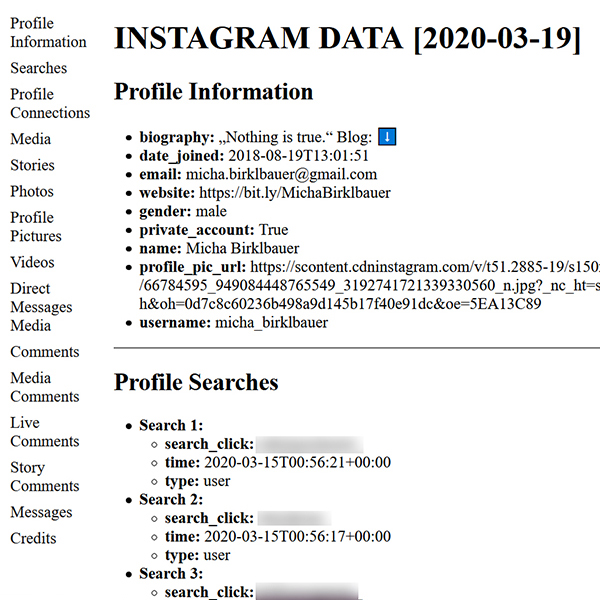
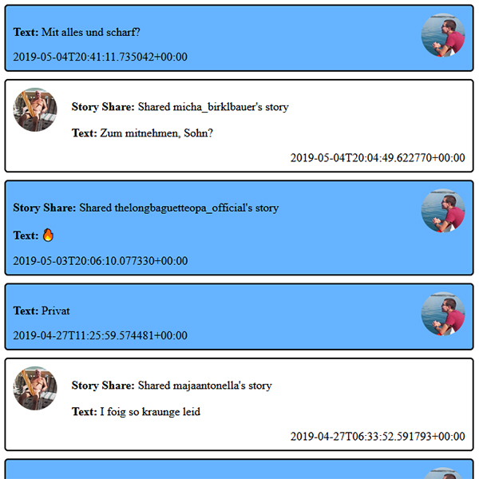
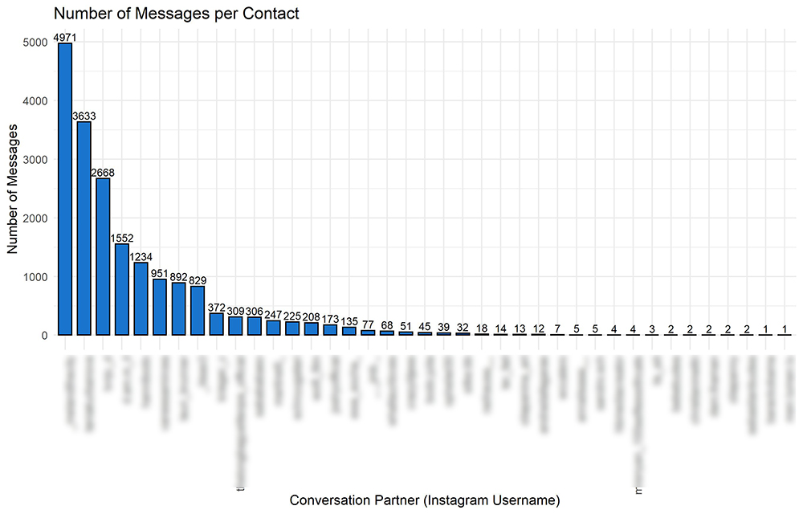

# Instagram JSON Viewer

This script transforms Instagram's data - [that you get via the Data Download Tool](https://www.instagram.com/download/request/) - to a readable format!

## Screenshots




## Features

- Transforms profile information, media and messages into a more readable html format!
- Creates separate html pages for each chat!
- Easy to use: Just execute the script in json-directory.
- Functions can be imported and tuned to your needs!

## Requirements

- Python (version 3.0 and above)

## Data Download

Here you can download your data: [Instagram](https://www.instagram.com/download/request/)

## Basic Usage

Tutorial Video: [https://www.youtube.com/watch?v=0CUbTkrK62M](https://www.youtube.com/watch?v=0CUbTkrK62M)

- Back up your instagram data before you run anything!
- If your instagram data is split into multiple files, you have to extract and merge them first (e.g. by copy-pasting the content into a single folder, and/or [merging json-files](https://stackoverflow.com/questions/57422734/how-to-merge-multiple-json-files-into-one-file-in-python)).
- Put "instaview.py" into the data directory (e.g. where the all json-files are!)  
  E.g. my downloaded zip-archive was named "micha_birklbauer_20200316.zip", extracted the directory looked like this:
  ```python
  """
  +---- micha_birklbauer_20200316
  + direct
  + photos
  + profile
  + stories
  + videos
  | account_history.json
  | autofill.json
  | checkout.json
  | comments.json
  | connections.json
  | contacts.json
  | likes.json
  | media.json
  | messages.json
  | profile.json
  | saved.json
  | searches.json
  | settings.json
  | stories_activities.json
  | instaview.py (PYTHON SCRIPT GOES HERE!)
  """
  ```
- Run "instaview.py" via commandline (recommended) or doubleclick!
- Alternatively you can run the ["instaview.exe"](https://github.com/t0xic-m/instagram_json_viewer/releases) if you have Windows and do not have python installed (steps are the same).
- Check "instaview_report.html" in the browser of your choice!

## Advanced Usage

```python
from instaview import *

instaview()
```

**Functions:**
- **read_profile(filename = "profile.json"):**  
  Reads profile information from json file and returns readable and structured html string.
  - **Args:**
    - filename (str): Path to json with profile information. Default: "profile.json".
  - **Return (list):**
    - html_string (str): json converted to html.
    - status (int): Amount of encountered errors.
    - error_log (str): Log of all encountered errors.
- **read_searches(filename = "searches.json"):**  
  Reads search information from json file and returns readable and structured html string.
  - **Args:**
    - filename (str): Path to json with search information. Default: "searches.json".
  - **Return (list):**
    - html_string (str): json converted to html.
    - status (int): Amount of encountered errors.
    - error_log (str): Log of all encountered errors.
- **read_connections(filename = "connections.json"):**  
  Reads connection information from json file and returns readable and structured html string.
  - **Args:**
    - filename (str): Path to json with connection information. Default: "connections.json".
  - **Return (list):**
    - html_string (str): json converted to html.
    - status (int): Amount of encountered errors.
    - error_log (str): Log of all encountered errors.
- **read_media(filename = "media.json"):**  
  Reads media information from json file and returns readable and structured html string.
  - **Args:**
    - filename (str): Path to json with media information. Default: "media.json".
  - **Return (list):**
    - html_string (str): json converted to html.
    - status (int): Amount of encountered errors.
    - error_log (str): Log of all encountered errors.
- **read_comments(filename = "comments.json"):**  
  Reads comment information from json file and returns readable and structured html string.
  - **Args:**
    - filename (str): Path to json with comment information. Default: "comments.json".
  - **Return (list):**
    - html_string (str): json converted to html.
    - status (int): Amount of encountered errors.
    - error_log (str): Log of all encountered errors.
- **read_messages(filename = "messages.json", profile = "profile.json", profile_pic = None, default_avatar = None, download_all = False, hd = False, avatars_dict = {}):**  
  Reads message information from json file and creates separate html files for each chat in new "chat" directory. Links to html pages are returned as concatenated html string together with a list of chat participants.
  - **Args:**
    - filename (str): Path to json with message information. Default: "messages.json".
    - profile (str): Path to json with profile information. Default: "profile.json".
    - profile_pic (str): Path or link to profile picture of your own user. Default: None (will be populated by method itself).
    - default_avatar (str): Path or link to default avatar. Default: None (uses instagram.com/instagram profile picture [1](#Disclaimer)).
    - download_all (bool): If all media links should be downloaded locally. Warning: This might take a very long time! Default: False.
    - hd (bool): If high definition versions of avatars should be used or not. Default: False.
    - avatars_dict (dict): A dictionary containing usernames and corresponding paths/links to profile pictures. Argument "profile_pic" overwrites user's avatar even if specified in avatars_dict. Default: empty dict (will be populated by method itself)
  - **Return (list):**
    - html_string (str): json converted to html (does not actually include chats, chats are written to files immediately).
    - chat_list (list of str): List of chats and their participants.
    - status (int): Amount of encountered errors.
    - error_log (str): Log of all encountered errors.
- **instaview(filenames = ["profile.json", "searches.json", "connections.json", "media.json", "comments.json", "messages.json"], title = None, show_credits = True, logging = True, \*\*kwargs):**  
  Executes all functions and creates an html report including information from all used json files. Returns 0 if everything went correctly.
  - **Args:**
    - filenames (list of str): A list with paths to the specific json files in the following order:
      1. Profile information
      2. Search information
      3. Connection information
      4. Media information
      5. Comment information
      6. Message information  
      Default: Default filenames for every function (see above).
    - parse (list of bool): A list of which json-files should be parsed. Default: [True, True, True, True, True, True] (all are parsed).
    - title (valid html as str): What the title of the report should be. Default: None ("INSTAGRAM DATA + [Date]").
    - show_credits (bool): If credits should be added at the bottom of the report. Default: True.
    - logging (bool): If error logs should be written to file. Default: True.
    - \*\*kwargs: any additional arguments will be passed to "read_messages()" (see above).
  - **Return (int):** 0 if successfully, >0 if unsuccesfull or only partly successful.

## Message Statistics



- Generates a bar-plot with total amount of messages per conversation!
- Execute "message_stats.py" and enter your username! Python 3 (or higher) and pandas required!
- Execute "message_stats.R"! R 3.5 (or higher) and ggplot2 required!

## Changes to old release

- Not reliant on R/Markdown/LaTeX anymore!
- HTML instead of PDF!
- PDF can still be created with browser!
- Full emoji/unicode support!
- Separate pages for chats!

## Known Issues

- I didn't include contacts.json since I didn't sync my contacts and therefore had no data available on that. Furthermore account_history.json, autofill.json, checkout.json, likes.json, saved.json, settings.json and stories_activities.json are also not included because I found the information in there is not really useful (e.g. likes.json/saves.json don't include post information etc.)!
- If you have huge amounts of chats avatars might not load correctly because instagram blocks your IP after too many requests. This might also happen if you run the script several times consecutively!
- Links to pictures/videos/etc. will time out after a few days. This is because instagram's access tokens provided in the json files expire. To save any media locally you can use "instaview(download_all=True)"!
- This is rather experimental since I only had my own data to test this with, there's no guarantee that this also works with your data!

## Disclaimer

- The current default avatar is the profile picture of the account [https://instagram.com/instagram](https://instagram.com/instagram)(08. July 2020) and is stored in this github repository for convenience. I do not own (the rights to) this picture!

## License

[MIT License](https://github.com/t0xic-m/instagram_data_download_viewer/blob/master/LICENSE.md)

## Download

- ZIP: [DOWNLOAD](https://github.com/t0xic-m/instagram_json_viewer/archive/master.zip)
- TAR.GZ: [DOWNLOAD](https://github.com/t0xic-m/instagram_json_viewer/archive/master.tar.gz)

## Contact

- Website: [Web](https://t0xic-m.github.io/web)
- Website: [GitHub](https://t0xic-m.github.io/)
- Contact: [Mail](mailto:micha.birklbauer@gmail.com)
